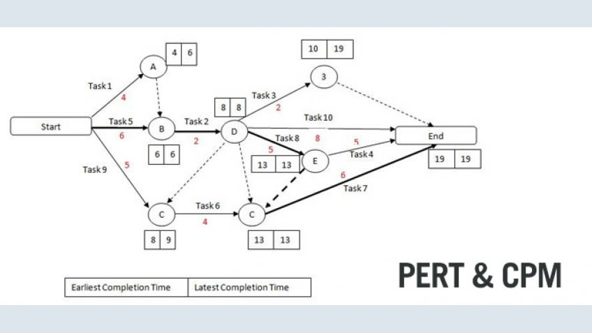

# Implementation Pert - find the shortest path

In this project i implemented pert using topoligical sort 

## Prerequisites

knowledge in python programming.

## What inside
 
 Topoligical sort algorithem using queue data structure to find the shortest path.
 
### Implementation of the exact picture below

